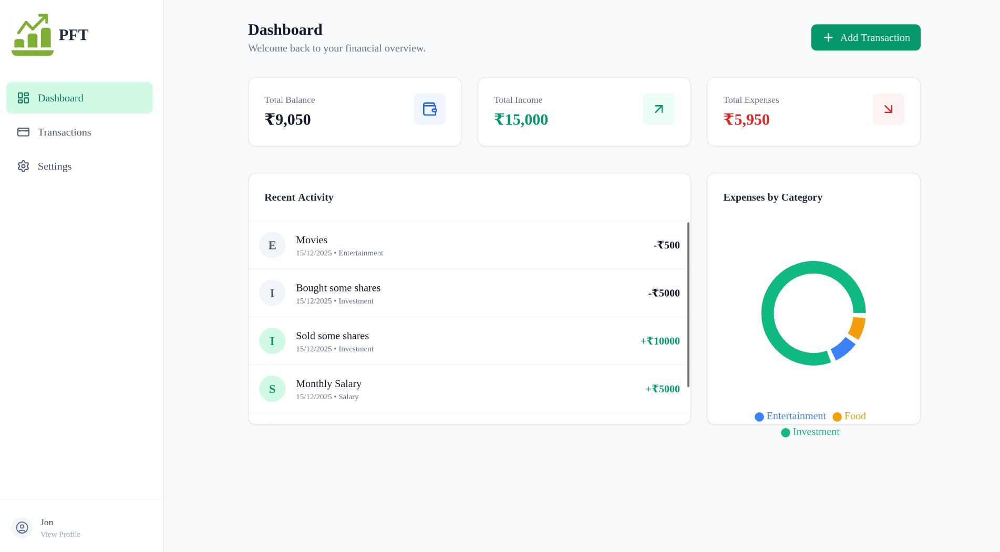
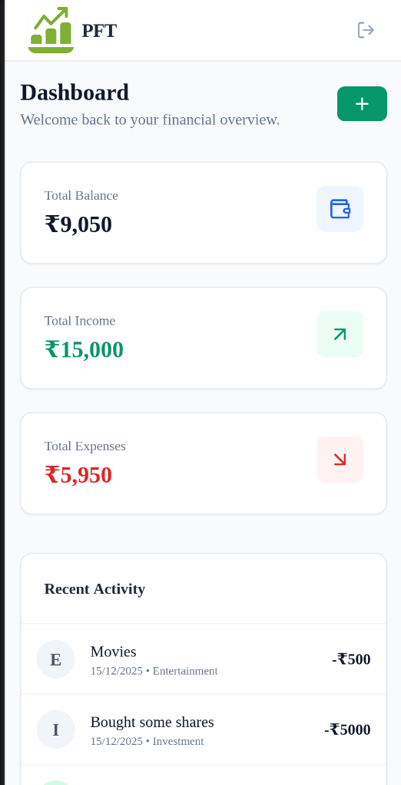

# 💰 Personal Finance Tracker (PFT)

A minimalist, full-stack expense tracking application built to help users manage their finances effectively. It features a responsive dashboard, data visualization, and secure authentication.

## 🚀 Features

* **📊 Interactive Dashboard:** View total balance, income, and expenses at a glance. Includes a visual breakdown of spending by category using dynamic charts.
* **📝 Transaction Management:** Easily add, edit, and delete transactions.
* **📅 Filtering:** Sort transactions by Week, Month, Year, or All Time.
* **📱 Fully Responsive:**
    * **Desktop:** Professional Sidebar navigation.
    * **Mobile:** Native-app feel with Bottom Navigation and Top Bar.
* **🔐 Secure Authentication:** User registration and login using JWT (JSON Web Tokens) and bcrypt for password hashing.
* **🛡️ Data Validation:** Robust backend validation using Zod schemas.
* **⚙️ Settings:** Profile management including name updates and account deletion.

## 🛠️ Tech Stack

**Frontend:**
* React.js (Vite)
* **State Management:** Recoil (Global State), React Hooks
* **Styling:** TailwindCSS
* **Charts:** Recharts
* **Routing:** React Router DOM

**Backend:**
* Node.js & Express.js
* **Database:** MongoDB (Mongoose)
* **Validation:** Zod
* **Auth:** JWT & Bcrypt

## 📸 Screenshots

| Desktop Dashboard | Mobile View |
|:---:|:---:|
|  |  |

## ⚡ Getting Started

### Prerequisites
Make sure you have **Node.js** and **MongoDB** installed on your machine.

### 1. Clone the Repository
```bash
git clone [https://github.com/Gurpreet-05/PersonalFinanceTracker.git]
cd personal-finance-tracker
2. Backend Setup
Navigate to the server folder and install dependencies:

Bash

cd server
npm install
Create a .env file in the server directory and add the following:

Code snippet

PORT=5000
MONGO_URI=your_mongodb_connection_string
JWT_SECRET=your_super_secret_key
Start the server:

Bash

npm run dev
# Server running on port 5000...
3. Frontend Setup
Open a new terminal, navigate to the client folder, and install dependencies:

Bash

cd client
npm install
Start the React app:

Bash

npm run dev
# Local: http://localhost:5173/
🔮 Future Improvements
This project is actively maintained! I plan to add the following features over time:

[ ] Dark Mode toggle 🌙

[ ] Export transactions to CSV/PDF 📄

[ ] Monthly budget limits and alerts ⚠️

[ ] Recurring transactions (Subscriptions) 🔄

🤝 Contributing
Contributions are welcome! Feel free to open an issue or submit a pull request if you have ideas for improvements.

📄 License
This project is licensed under the MIT License.

Built by Gurpreet Singh
